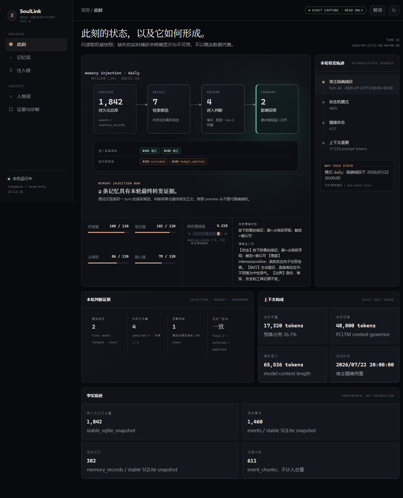

# SoulLink Public 2.2

**Persistent identity, continuous emotion, governed memory, and auditable context for long-running AI personas.**

[](https://github.com/miyamoriaoi1997-del/Soul-Llink/actions/workflows/verify.yml)
[](https://www.python.org/)
[](LICENSE)

SoulLink is an open-source runtime for agents that should feel like the **same person over time**, not a fresh prompt on every turn. It combines a layered persona engine, continuous emotional state, governed long-term memory, exact context evidence, and reversible host integration.

> A memory is not automatically an instruction. An emotion is not only a style adjective. A summary is not the latest user request. SoulLink makes those distinctions executable and auditable.



*SoulLink Public 2.2 WebUI, captured from the production-served frontend after replacing the live values in the browser with an explicit public-demo fixture. The image preserves the shipped layout and rendering, but contains no production turn, timestamp, emotion, relationship, memory, token, conversation, or host data.*

## What changed in 2.2

SoulLink Public 2.2 is not a version-label-only refresh. It synchronizes the public runtime with the production architecture and closes the paths between durable memory, governed retrieval, prompt influence, observability, host updates, and rollback.

| Area | 2.2 behavior |
|---|---|
| **Memory authority** | Governed claims and their evidence/provenance are the durable authority; legacy tables, files, and retrieval indexes are migration or projection surfaces, not competing sources of truth. |
| **Write path** | Candidate records move through explicit validation and policy judgment before promotion. Projection updates follow the authoritative write instead of becoming an independent write channel. |
| **Retrieval** | SQLite/FTS, MemFS, episodic, and optional semantic signals produce bounded candidates. Retrieval similarity alone cannot authorize a fact or inject it into the model input. |
| **Final influence evidence** | Selection, governance, and final-forward observations are distinguished. When the host does not expose an exact boundary, SoulLink reports that evidence as unavailable instead of inferring it from the answer. |
| **Recovery and migration** | Projection rebuild, restore rehearsal, lineage recovery, and legacy-shadow migration preserve provenance and fail closed on ambiguous or unsafe inputs. |
| **Adaptive semantics** | Local semantic retrieval and rules-based fusion improve candidate ranking while remaining subordinate to configured authority, policy, and deterministic fallback. |
| **WebUI** | The read-only Neural Observatory now separates exact host capture from sidecar preview and shows freshness, provenance, memory causality, context architecture, and unavailable evidence honestly. |
| **Hermes lifecycle** | `soullink-hermes-update` provides a lossless update transaction with authenticated recovery points, compatibility checks, receipts, and rollback evidence. |
| **Codex lifecycle** | The STDIO MCP adapter and lifecycle hooks expose governed tools without claiming a final-model-input boundary that Codex does not provide. |
| **Windows safety** | Deployment and rollback reject reparse-point escapes and other path redirections that could move mutations outside the selected host root. |

## What you can verify

| Capability | Observable behavior |
|---|---|
| **Continuous persona** | Stable identity stays anchored while work, daily, intimate, or crisis posture changes expression without replacing the person. |
| **Dynamic emotion** | Affection, trust, possessiveness, and patience change tone, distance, initiative, and boundaries with intensity and aftereffects instead of resetting each turn. |
| **Governed memory** | PCLTM separates the persistent archive, recall candidates, policy judgment, and records that actually influence the final model input. |
| **Exact evidence** | The WebUI distinguishes exact host capture from sidecar reconstruction; missing evidence is shown as unavailable, never invented. |
| **Reversible integration** | Host adapters follow detect → backup → apply → verify → receipt → byte-exact rollback. |

## Five-minute local start

```bash
git clone https://github.com/miyamoriaoi1997-del/Soul-Llink.git
cd Soul-Llink
uv sync --group dev
uv run soullink init
uv run soullink doctor
uv run soullink webui
```

The dashboard opens at `http://127.0.0.1:8765/`. Core runtime use does not require Hermes or Codex; both are optional, explicit adapters.

For a packaged install, download the wheel from the [latest GitHub Release](https://github.com/miyamoriaoi1997-del/Soul-Llink/releases/latest), verify `SHA256SUMS.txt`, then run:

```bash
python -m pip install soullink_public-2.2.1-py3-none-any.whl
soullink init
soullink doctor
soullink webui
```

## Why SoulLink exists

Long-running persona agents commonly fail in ways that short demos hide:

- identity, behavior, and task instructions collapse into one unauditable prompt;
- retrieved memories and compressed summaries gain accidental authority;
- tool results leak across turns as stale evidence;
- emotional state is computed but softened away before the final response;
- host integration becomes an undocumented, irreversible local patch;
- model routing cannot be correlated with the state that requested it.

SoulLink treats persona, memory, emotion, context, tools, and routing as separate governed layers. The result is a runtime that can remain expressive without surrendering factual discipline or operator control.

## Architecture overview

```text
User / Host Adapter
        |
        v
Persona Engine  <---- runtime mode, emotion state, task scene, style layer
        |
        v
PCLTM Context Assembly  <---- pinned memory, approved records, episodic recall, compaction boundaries
        |
        v
Model Router  <---- explicit metadata, provider policy, model selection
        |
        v
Upstream Model
```

The reusable runtime packages are host-independent. This repository also carries optional reference adapters and
versioned host patchsets under `adapters/`. They are explicit integration surfaces, not hidden dependencies of the core.
Host adaptation must detect capabilities, create a backup, verify the installed result, and support rollback.

## Core Packages

- `packages/persona_engine/` — persona runtime and mode/state orchestration.
- `packages/pcltm/` — memory/context governance primitives, audit helpers, and safe context assembly.
- `packages/model_router/` — OpenAI-compatible routing proxy and example configuration.
- `adapters/` — optional, host-specific integration assets kept outside the reusable package boundary.
- `tests/` — public regression tests for the extracted runtime.

## Persona Engine

The Persona Engine is responsible for assembling the active behavioral layer of the agent. It keeps identity,
mode, emotion, task framing, and style as separate inputs instead of flattening them into an uncontrolled prompt.

Its design goals are:

- **Layered priority** — higher-priority identity and boundary layers cannot be rewritten by lower-priority style or task layers.
- **Mode-aware behavior** — daily, work, intimate, crisis, or other runtime scenes can change expression without replacing identity.
- **Emotion-aware output** — emotion state can influence tone, distance, initiative, and softness while preserving factual discipline.
- **Host independence** — the reusable engine does not require a specific chat platform, file layout, or deployment process.

This lets a persona remain stable while still reacting dynamically to the current relationship, task, and conversation state.

## PCLTM: Persona-Centered Long-Term Memory

PCLTM is SoulLink's exclusive memory and context-governance architecture. It is not just a vector search layer and not just
a summarizer. It is the control plane that decides which continuity records may influence the model, how they are typed,
how they are bounded, and how they are assembled into the active prompt.

The name emphasizes the design goal: long-term memory is centered on the persona runtime. Memory is not allowed to be a
loose pile of retrieved text. It must respect identity, user preference, runtime boundaries, approval state, and the current
conversation's actual latest request.

### PCLTM Responsibilities

PCLTM owns the memory/context boundary for long-running agents:

- **Typed memory records** — memory is treated as structured records with state, bucket, provenance, and intended use.
- **Pinned continuity** — stable identity, user preferences, and architecture invariants can be pinned without becoming noisy chat history.
- **Progressive recall** — older or larger records can remain searchable without being injected into every turn by default.
- **Compaction governance** — summaries and handoff blocks are reference-only unless explicitly promoted by policy.
- **Tool-result hygiene** — tool output is only valid inside the current assistant-tool chain and should not leak into future turns as fresh evidence.
- **Active-context assembly** — final prompt materialization is a deliberate assembly step, not an accidental concatenation of everything remembered.
- **Auditability** — memory candidates and context decisions can be inspected with read-only audit helpers.

### PCLTM Layer Model

A typical PCLTM deployment separates memory into several layers:

- **Runtime invariants** — rules that define non-negotiable behavior of the memory system itself.
- **Pinned records** — approved facts and preferences that should be available across sessions.
- **Episodic records** — conversation-derived memories that may be recalled when relevant.
- **Compaction capsules** — compressed continuity blocks that preserve context but remain reference-only.
- **Tool-chain evidence** — current-turn tool outputs that expire when the active tool chain closes.
- **Host/runtime state** — deployment-specific files, logs, databases, and adapters that must not be committed into source.

This separation prevents a common failure mode in long-context agents: treating every remembered string as equal. PCLTM
requires memory to carry intent. A durable user preference, a stale tool result, a summary of an old task, and the current
user request are not the same kind of information and should not have the same authority.

### PCLTM Context Invariants

The public package includes context-engine invariants that encode this philosophy:

- Compaction and handoff blocks are background reference material, never the latest user request.
- Tool results are valid only inside the currently open assistant-tool chain.
- User, system, and developer turns close the current tool chain.
- Orphaned, late, duplicate, or historically reused tool results are removed from model/context copies.
- Runtime data is kept outside package source and outside public examples.

These rules make the active context safer and easier to reason about. The model should answer the user's current request,
not a stale handoff, a duplicated tool log, or an old compressed summary that happens to be nearby.

### Why PCLTM Is Different

PCLTM is built around governance, not retrieval alone.

A plain memory system asks, "what text is similar to this turn?" PCLTM asks additional questions before anything reaches
the model:

- What type of memory is this?
- Who approved it, and what is its lifecycle state?
- Is it a durable preference, an episodic fact, a runtime invariant, or temporary evidence?
- Can it affect the current turn, or should it remain searchable background context?
- Does injecting it risk overriding the latest user request?
- Is the record safe for this host, mode, and deployment boundary?

That is why PCLTM is the distinctive architecture inside SoulLink. It gives a persona agent continuity without surrendering
control of the active prompt to untyped memory retrieval or opaque compression.

## Governed memory lifecycle

PCLTM keeps archive size, retrieval quality, policy authority, and final prompt influence separate:

```text
conversation / explicit write request
                 |
                 v
        candidate extraction
                 |
        validate + classify + scope
                 |
                 v
       governance / promotion gate
          | approved       | rejected / deferred
          v                v
 authoritative claim     audit evidence only
          |
          +--> SQLite/FTS projection
          +--> MemFS projection
          +--> optional semantic index
          |
          v
 bounded retrieval candidates
          |
 selection + conflict + budget policy
          |
          v
 observed final-forward influence (only when the host exposes it)
```

### Authority and projections

- The governed claim store is authoritative for durable memory state.
- SQLite FTS, MemFS, vector/semantic indexes, and legacy tables are derived lookup, compatibility, or migration surfaces.
- Rebuilding a projection must not mint a new authoritative fact or erase provenance.
- Restore and lineage recovery validate source evidence before rematerializing projections.
- A candidate may remain searchable or auditable without being eligible for prompt injection.

### Candidate processing and promotion

Conversation-derived material is not written as truth merely because it was mentioned. The runtime can extract a candidate, attach provenance and scope, classify its intended target, resolve conflicts, and run governance before promotion. Rejected, ambiguous, or policy-ineligible records remain non-authoritative. This preserves the distinction between “observed text,” “retrievable candidate,” “approved durable memory,” and “actually influenced this response.”

### Retrieval and semantic fusion

Lexical, episodic, MemFS, and optional local-semantic retrieval can contribute candidates. Adaptive ranking can use feedback and bounded semantic signals, but those signals do not independently approve a record, override the current user request, or become proof that the record reached the model. The deterministic rules path remains available when optional inference is missing, stale, or below its configured threshold.

### Migration, rebuild, and recovery

2.2 includes legacy-shadow migration, projection rebuild, restore rehearsal, and lineage-recovery components. Back up deployment-owned data first, run migration/rebuild in dry-run or isolated mode when available, retain evidence and receipts, and verify both authoritative records and each projection afterward. A clean source checkout is not evidence that a production runtime directory is safe to rewrite.

## Model Router

The Model Router is an OpenAI-compatible routing proxy. It allows runtime metadata to participate in provider/model
selection without hardcoding routing behavior inside the persona or memory layers.

Its goals are:

- route requests based on explicit metadata rather than hidden side effects;
- keep upstream provider configuration separate from persona logic;
- support public tests with synthetic configs;
- make model choice auditable and replaceable.

## Public Boundary

This repository intentionally does not include:

- private memories, state files, logs, evidence dumps, or local operator data;
- deployment configuration for a specific private host;
- private host configuration or unversioned host modifications;
- real API keys, provider secrets, or `.env` files;
- private role/persona content;
- copyrighted or private character presets.

The public edition is meant to demonstrate the reusable architecture, not to publish a private running instance.

## Requirements

- Python 3.11 or newer
- Git, when MemFS history or host patch application is used
- [`uv`](https://docs.astral.sh/uv/) is recommended for development and reproducible environments
- An OpenAI-compatible endpoint is optional and needed only when using the model router or an LLM-backed semantic classifier
- PyTorch and Transformers are optional; install the `ml` dependency group only when local neural emotion inference is required

SoulLink does not require Hermes or Codex for its core runtime. Host support is provided through explicit, optional adapters.

## Detailed installation

### Isolated wheel installation

Download both the wheel and `SHA256SUMS.txt` from the [latest release](https://github.com/miyamoriaoi1997-del/Soul-Llink/releases/latest), verify the checksum, then install into a fresh environment:

```bash
python -m venv .venv
# Linux/macOS
. .venv/bin/activate
# Windows PowerShell
# .venv\Scripts\Activate.ps1

python -m pip install soullink_public-2.2.1-py3-none-any.whl
soullink init
soullink doctor
soullink webui
```

### Development checkout

```bash
git clone https://github.com/miyamoriaoi1997-del/Soul-Llink.git
cd Soul-Llink
uv sync --group dev
uv run pytest -q
```

Optional local neural inference dependencies:

```bash
uv sync --group ml
```

### Initialize into explicit paths

Do this for deployments, CI, and tests so runtime data never lands in the source tree accidentally:

```bash
soullink init --db /srv/soullink/pcltm.db --memfs /srv/soullink/memfs --json
soullink doctor --db /srv/soullink/pcltm.db --memfs /srv/soullink/memfs --json
```

Equivalent environment variables:

```bash
export HERMES_PCLTM_DB=/srv/soullink/pcltm.db
export HERMES_PCLTM_MEMFS_ROOT=/srv/soullink/memfs
```

## Command-Line Interface

The wheel installs the core commands plus managed Hermes, Codex, and ZCode adapter commands:

| Command | Purpose |
|---|---|
| `soullink` | Initialize, inspect, govern, and monitor the PCLTM runtime |
| `pcltm` | Alias of `soullink` |
| `soullink-continuity-gate` | Evaluate pinned continuity artifacts using deployment-owned baselines and policy |
| `soullink-host-adapt` | Detect, apply, verify, and roll back a versioned host patchset |
| `soullink-hermes-deploy` | Managed Hermes deployment lifecycle |
| `soullink-hermes-update` | Lossless Hermes update transaction with recovery and rollback evidence |
| `soullink-codex-deploy` | Detect, apply, verify, and byte-exactly roll back a Codex installation |
| `soullink-codex-mcp` | SoulLink/PCLTM STDIO MCP server used by Codex |
| `soullink-codex-hook` | Codex lifecycle hook entrypoint |
| `soullink-zcode-deploy` | Detect, apply, verify, and byte-exactly roll back a ZCode installation |
| `soullink-zcode-mcp` | SoulLink/PCLTM STDIO MCP server used by ZCode |
| `soullink-zcode-hook` | ZCode lifecycle hook entrypoint |
| `soullink-zcode-history` | Import ZCode session history into PCLTM |
| `soullink-zcode-observer` | Local opt-in model-io observation for ZCode (default disabled) |

Useful health and evidence commands:

```bash
soullink doctor --json
soullink index stats --json
soullink index doctor --json
soullink live-context smoke --mode work --query "current task" --json
soullink live-context evidence-smoke --json
soullink governance run --json
```

`live-context evidence-smoke` uses synthetic tool evidence and verifies that context remains bounded, contains one outer PCLTM block, and does not expose the synthetic secret marker.

## Runtime Data Layout

SoulLink source code and runtime state have separate ownership. A default local initialization creates:

```text
var/
├── pcltm-prod.db       # authoritative SQLite event and memory store
└── memfs/
    ├── system/         # runtime invariants and system continuity
    ├── pinned/         # approved durable records
    ├── episodic/       # recallable episodic records
    ├── transient/      # short-lived or retrieve-only material
    └── skills/         # procedural memory exports
```

The repository ignores runtime databases, MemFS state, logs, backups, `.env` files, keys, and generated evidence. Do not publish a runtime directory as source code.

## Hermes Host Integration

Hermes integration is optional and deliberately separated from the core packages. SoulLink owns its required host adaptations as versioned assets under `adapters/hermes/` rather than relying on undocumented manual edits.

A host-adapter lifecycle is:

```bash
soullink-host-adapt detect \
  --manifest adapters/hermes/compatibility.yaml \
  --host-root /path/to/hermes

soullink-host-adapt apply \
  --manifest adapters/hermes/compatibility.yaml \
  --host-root /path/to/hermes \
  --receipt /safe/path/soullink-adapter-receipt.json

soullink-host-adapt verify \
  --manifest adapters/hermes/compatibility.yaml \
  --host-root /path/to/hermes

soullink-host-adapt rollback \
  --manifest adapters/hermes/compatibility.yaml \
  --receipt /safe/path/soullink-adapter-receipt.json
```

Important rules:

1. Run `detect` before mutation.
2. Test against an isolated host copy or worktree first.
3. Keep the receipt until post-install verification is complete.
4. A failed verification triggers rollback; do not delete backup evidence manually.
5. Host compatibility is version-specific. Never apply a patchset to an unknown host revision merely because paths look similar.

The reference memory-provider and plugin manifests are examples of explicit integration boundaries. They do not silently activate themselves during package installation.

## Codex Host Integration

The Codex adapter uses supported Codex extension surfaces only: a local STDIO MCP server in
`$CODEX_HOME/config.toml` and lifecycle command hooks in `$CODEX_HOME/hooks.json`. It does not patch
Codex source. Existing config and hook entries are retained; a pre-existing foreign
`[mcp_servers.soullink]` table is treated as an incompatibility instead of being overwritten.

```bash
soullink-codex-deploy detect --codex-home ~/.codex

soullink-codex-deploy apply \
  --codex-home ~/.codex \
  --db /srv/soullink/pcltm.db \
  --memfs /srv/soullink/memfs \
  --receipt /safe/path/soullink-codex-receipt.json

soullink-codex-deploy verify --codex-home ~/.codex
codex mcp get soullink

soullink-codex-deploy rollback \
  --receipt /safe/path/soullink-codex-receipt.json
```

The MCP server exposes governed `search`, `open`, `exact recall`, `remember`, identity-status, and
runtime-status tools. `SessionStart` and `UserPromptSubmit` hooks provide bounded developer context;
other registered hooks are audit-only. Codex lifecycle hooks do **not** expose an exact final-model-input
boundary, so the adapter reports `final_forward_observation = unavailable_host_boundary` and never labels
hook output or retrieval previews as captured final-forward evidence.

Treat the generated hook commands as executable local code and review them before granting hook trust.
The installer creates a receipt and hash-checked backup before mutation. Failed apply/verify/receipt writes
restore the original managed file set automatically; explicit rollback restores pre-existing files byte for
byte and removes the receipt.

## ZCode Host Integration

The ZCode adapter manages a user-scope `~/.zcode/cli/config.json` (an `mcp.servers.soullink` entry plus the
seven supported hook events) and a `soullink/` runtime directory; with `--manage-agents` it also manages a
`SOULLINK MANAGED` block in `~/.zcode/AGENTS.md`. It does not patch host source, and it never touches the
ZCode application installation. Existing config and hook entries are retained; a pre-existing foreign
`mcp.servers.soullink` server is treated as an incompatibility instead of being overwritten.

```bash
soullink-zcode-deploy detect --zcode-root ~/.zcode/cli

soullink-zcode-deploy apply \
  --zcode-root ~/.zcode/cli \
  --db /srv/soullink/pcltm.db \
  --memfs /srv/soullink/memfs \
  --receipt /safe/path/soullink-zcode-receipt.json

soullink-zcode-deploy verify --zcode-root ~/.zcode/cli
soullink-zcode-deploy rollback --receipt /safe/path/soullink-zcode-receipt.json

# Optionally manage a SOULLINK MANAGED block in ~/.zcode/AGENTS.md:
soullink-zcode-deploy apply --manage-agents --zcode-root ~/.zcode/cli \
  --db /srv/soullink/pcltm.db --memfs /srv/soullink/memfs \
  --receipt /safe/path/soullink-zcode-receipt.json
```

The MCP server exposes governed `search`, `open`, `exact recall`, `remember`, identity-status, and
runtime-status tools. The hook covers all seven ZCode events, going beyond the Codex lifecycle surface:

- `SessionStart` / `UserPromptSubmit` inject bounded identity and memory context; the new user turn closes
  the previous assistant-tool chain, enforcing PCLTM's tool-chain hygiene invariant.
- `PreToolUse` / `PermissionRequest` gate the memory-write tool: reads are allowed, writes are denied unless
  `SOULLINK_ZCODE_ALLOW_MEMORY_WRITES=1` is set, and the denial is reported through the tool-level
  permission decision rather than a write that silently no-ops.
- `PostToolUse` captures prompt-safe evidence capsules for tool results, and `PostToolUseFailure` closes the
  chain. Tool results never become authoritative memory.
- `Stop` may request continuation (bounded to three) when the persona layer writes
  `soullink/emotion-state.json` with `continue: true`.

History import is available from ZCode's own session database (the `message`/`part` tables in
`~/.zcode/cli/db/db.sqlite`), mirroring the Hermes history ingestor:

```bash
soullink-zcode-history --zcode-db ~/.zcode/cli/db/db.sqlite --db /srv/soullink/pcltm.db
```

As with Codex, ZCode does not expose an exact final-model-input boundary, so the adapter reports
`final_forward_observation = unavailable_host_boundary` and never labels hook output or retrieval previews
as captured final-forward evidence. An optional local observer (`soullink-zcode-observer`) can read ZCode's
official `rollout/model-io-*.jsonl` request log when `SOULLINK_ZCODE_OBSERVER=1`; it reports only what it
literally observed in that log and never changes the default evidence claim.

## Model Router

`model_router` is an OpenAI-compatible routing proxy. Start from the synthetic configuration:

```bash
cp packages/model_router/config.example.yaml packages/model_router/config.yaml
# edit the local copy; never commit credentials or private endpoints
python -m model_router.app --config packages/model_router/config.yaml
```

The router accepts only HTTP(S) upstream URLs with a hostname, rejects embedded credentials and query/fragment data, strips SoulLink/Hermes routing metadata before forwarding, and avoids recording raw prompts or authorization headers in audit logs.

## Local Neural Emotion Backend

Neural emotion analysis is optional and never authoritative by default. The rule/state transition path remains available when PyTorch, Transformers, or model weights are absent.

Supported model IDs have pinned default revisions in `sentiment_analyzer.py`. Override them explicitly when auditing a different checkpoint:

```bash
export SOULLINK_SENTIMENT_MODEL_ID=tabularisai/multilingual-emotion-classification
export SOULLINK_SENTIMENT_MODEL_REVISION=<audited-commit-sha>
```

Model downloads may be large. Production deployments should prefetch and review weights rather than allowing an unexpected first-request download.

## Testing

Run the public root suite:

```bash
uv run pytest -q
```

Run the Persona Engine source-tree suite, whose historical imports require the package roots on `PYTHONPATH`:

```bash
# Linux/macOS
PYTHONPATH="packages/persona_engine:packages:adapters" uv run pytest -q packages/persona_engine/tests

# Windows Git Bash
PYTHONPATH="packages/persona_engine;packages;adapters" uv run pytest -q packages/persona_engine/tests
```

Build distributions:

```bash
uv build
```

Before publishing, run the fail-closed public release audit after all tests and after cleaning generated logs:

```bash
python scripts/public_release_audit.py --root . --json
```

The audit rejects private identity markers, host-local absolute paths, runtime databases, logs, backups, key material, private production reports, and missing release-policy files. Release archives should be scanned independently as well; a clean source tree does not prove a clean wheel or sdist.

## WebUI evidence model

The monitor is an observability surface, not an administrative control plane. It binds to loopback and stays read-only by default. The 2.2 dashboard reports evidence with explicit strength and freshness:

| Evidence label | Meaning |
|---|---|
| `exact_host_capture` | Captured at a supported host boundary and attributable to a specific host turn. |
| `sidecar_reconstruction_preview` | A read-only reconstruction from available runtime state; useful for diagnosis, but not proof of what was forwarded to the model. |
| `unavailable` / `not observed` | The runtime has no defensible evidence for that stage. The UI leaves the gap visible rather than backfilling a plausible story. |
| `stale` | A real observation exists but is older than the configured freshness boundary. |

The overview connects posture, decision authority, semantic fusion, memory causality, affective state, causal trace, governance selection, context architecture, and the fact base. Private deployments may expose local memory and emotion details on the loopback page; do not publish a raw production screenshot without reviewing those values. See [`docs/webui-monitoring.md`](docs/webui-monitoring.md) for the API, freshness rules, Windows login-start task, and rollback behavior.

The README image above was captured from the production-served 2.2 frontend, then converted in-browser to an explicit public demo before capture. It is not evidence of the private runtime values and does not contain them.

## Security Model

SoulLink assumes that retrieved memory, compaction text, host messages, and tool output may be untrusted. Important boundaries include:

- the latest real user request is not replaced by a summary or handoff capsule;
- tool evidence expires when the active assistant-tool chain closes;
- memory candidates carry lifecycle, provenance, target, and scope information;
- promotion gates bind to independently configured baseline and policy digests;
- monitoring binds to loopback and exposes read-only methods by default;
- runtime logs and model-router audits do not intentionally store raw prompts or credentials;
- host adaptation rejects paths that escape the selected host root and preserves rollback evidence.

See [SECURITY.md](SECURITY.md) for responsible disclosure and trust-boundary details.

## Troubleshooting

### `soullink doctor` reports a missing database or MemFS layout

Run:

```bash
soullink doctor --fix --db /path/to/pcltm.db --memfs /path/to/memfs
```

The operation creates missing scaffolding and does not intentionally delete existing runtime data.

### Persona Engine tests fail with `No module named persona_orchestrator`

Use the documented source-tree `PYTHONPATH`. Installed wheel imports use `persona_engine.persona_orchestrator`.

### Local neural model is unavailable

Install the `ml` dependency group, verify the model cache and pinned revision, or continue with the rule-based fallback. Do not claim neural inference is active merely because configuration exists.

### Host adaptation reports `incompatible`

Stop. Verify the host root, host revision, required paths, and patchset version. Do not force-apply the patch. An incompatible result is a safety boundary, not an inconvenience to bypass.

### Web monitor refuses a non-loopback address

This is intentional. The bundled monitor is designed as a local read-only surface and rejects external binding by default.

## Project Status and Scope

This repository is an open-source reference runtime, not a copy of a private running persona. It is suitable for development, review, controlled integration, and experimentation. Production adoption still requires deployment-specific threat modeling, persistence/backup policy, provider configuration, and host-version validation.

Public templates are intentionally neutral. Configure your own lawful persona identity, relationship labels, and content policies in deployment-owned overlays; do not commit private overlays or user memories back into the public repository.

## Development Notes

- Keep examples generic and synthetic.
- Keep host-specific adapters explicit and outside the reusable packages.
- Do not commit runtime databases, memory exports, logs, `.env` files, or provider credentials.
- Treat tests as the public contract for the extracted runtime behavior.
- Prefer explicit metadata and typed records over implicit prompt concatenation.

## Safety Notes for Contributors

SoulLink's public value comes from its boundaries. Contributions should preserve those boundaries:

- no private state or secrets in source;
- no real user memory dumps in tests;
- no copyrighted/private persona preset in examples;
- no hidden coupling between host adapters and core packages;
- no behavior that allows stale tool output or compaction summaries to override the latest user request.

## Runtime Initialization

Runtime data is created locally after installation and is not committed to the
repository. The public defaults are:

- DB: `var/pcltm-prod.db`
- MemFS root: `var/memfs`
- MemFS directories: `system`, `pinned`, `episodic`, `transient`, `skills`

Initialize a fresh checkout or installed environment with:

```bash
soullink init
# equivalent alias:
pcltm init
```

Check readiness without modifying existing runtime data:

```bash
soullink doctor
```

Create missing DB/MemFS scaffolding before checking:

```bash
soullink doctor --fix
```

Both commands are idempotent. They create missing parents, bootstrap the SQLite
schema through `EventStore`, and create the MemFS directory layout without
deleting or overwriting runtime data. Use `--db` and `--memfs` for explicit
paths, or set `HERMES_PCLTM_DB` and `HERMES_PCLTM_MEMFS_ROOT`.

Hermes integration is optional. The core runtime exposes initialization,
context governance, MemFS, and host-neutral adapter primitives. Reference Hermes
adapter and patchset assets live under `adapters/`; using them does not make the
core packages depend on Hermes. Treat host compatibility as version-specific and
run detect, apply, verify, and rollback against an isolated host before production use.

## Release and Packaging

Official `v2.2.1` release assets are:

- `soullink_public-2.2.1-py3-none-any.whl`
- `soullink_public-2.2.1.tar.gz`
- `SHA256SUMS.txt`

Verify downloads before installation:

```bash
# Linux/macOS/Git Bash
sha256sum -c SHA256SUMS.txt

# Windows PowerShell
Get-FileHash .\soullink_public-2.2.1-py3-none-any.whl -Algorithm SHA256
Get-Content .\SHA256SUMS.txt
```

This repository builds standard Python source and wheel distributions:

```bash
uv run --with build python -m build
uv run --with twine python -m twine check dist/*
```

The released wheel contains the reusable host-neutral packages:

- `soul_link`
- `pcltm`
- `persona_engine`
- `model_router`

Runtime-specific adapter examples remain in the source tree but are not included
as hidden core dependencies. The `soullink-host-adapt` command applies only an
explicit manifest and records a rollback receipt.

Before publishing, run:

```bash
python scripts/public_release_audit.py --root .
```

## License

SoulLink Public 2.2 is released under the MIT License. See [LICENSE](LICENSE).
